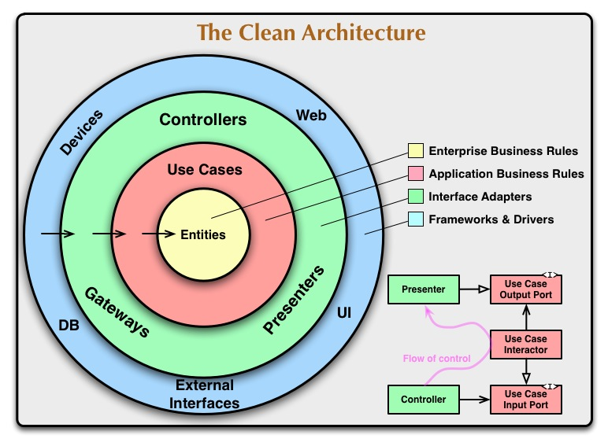

# Clean Architecture Rust Example

## Clean Architecture



https://blog.cleancoder.com/uncle-bob/2012/08/13/the-clean-architecture.html

### Usage

- Create a student.

  ```sh
  $ curl -d '{"id":0,"name":"Alice"}' localhost:8080/students
  {"message":"Student created successfully"}
  ```

- Find a student by ID.

  ```sh
  $ curl localhost:8080/students/0
  {"ID":0,"Name":"Alice"}

  $ curl localhost:8080/students/1
  {"message":"Student not found"}
  ```

## TODOs

- Add database
  - PostgreSQL
